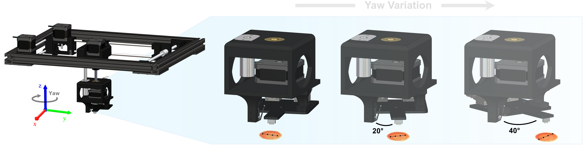

# Robotic-Conductivity-Probe-Optimization
 


## Overview
This toolkit provides robust methods for image segmentation and path planning, employing Meta AI's Segment Anything model and optimization techniques for efficient pathfinding.

## Features
- Image segmentation using Meta AI's Segment Anything model.
- Watershed segmentation to refine image segmentation.
- Path planning with optimized probe poses.
- Evaluation of probe contact points within segmented regions.
- Maximizing spatial and angular variation of poses.

## Dependencies
- `numpy`
- `pandas`
- `matplotlib`
- `scipy`
- `opencv-python (cv2)`
- `scikit-learn`
- `segment_anything` (Meta AI's Segment Anything Model)

## Installation
Ensure all dependencies are installed using pip:
```bash
pip install numpy pandas matplotlib scipy opencv-python scikit-learn
```
- `segment_anything` must be installed separately as per its documentation.

## Usage
### Image Segmentation
```python
generate_segments(image, checkpoint, model_type, min_size=None, max_size=None)
```
- `image`: Input image for segmentation.
- `checkpoint`: Model weights for Segment Anything Model.
- `model_type`: Type of the Segment Anything Model.
- `min_size`, `max_size`: Optional size constraints for segmentation.

### Probe Pose Optimization
```python
probe_contact(midpoint, rotation, probe_stroke_px)
generate_valid_poses(droplet, num_poses, max_angle, probe_stroke_px)
reward_function(droplet, poses, max_poses, max_angle, probe_stroke_px, verbose=False)
```
- These functions generate the optimal poses for a given material droplet.

### Path Planning Optimization
```python
path_planning(poses, noise_level, start=[0,0], optimization_rounds=1000)
```
- Path plans are optimized using a stochastic nearest neighbors approach at varying noise levels.

## Examples
| Files | Description |
| ------------- | ------------------------------ |
|[Camera_Intrinsics_Calibration.ipynb](./Camera_Intrinsics_Calibration.ipynb)|  A python notebook with an example of performing camera calibration.|
|[Pose_and_Path_Optimization.ipynb](./Pose_and_Path_Optimization.ipynb)| A python notebook with an example data set demonstrating optimization of poses and path plans.|
|[robot_functions.py](./robot_functions.py)| A python file with all necessary functions to perform pose and path optimization.|
